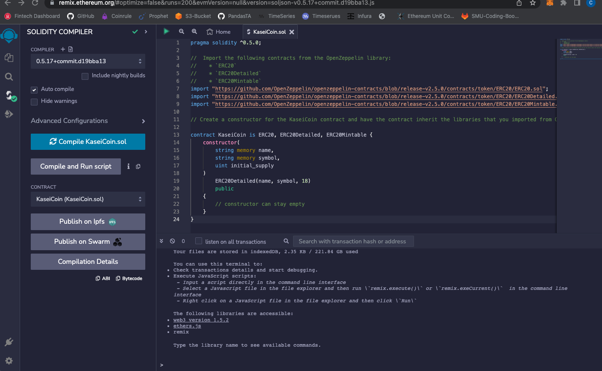
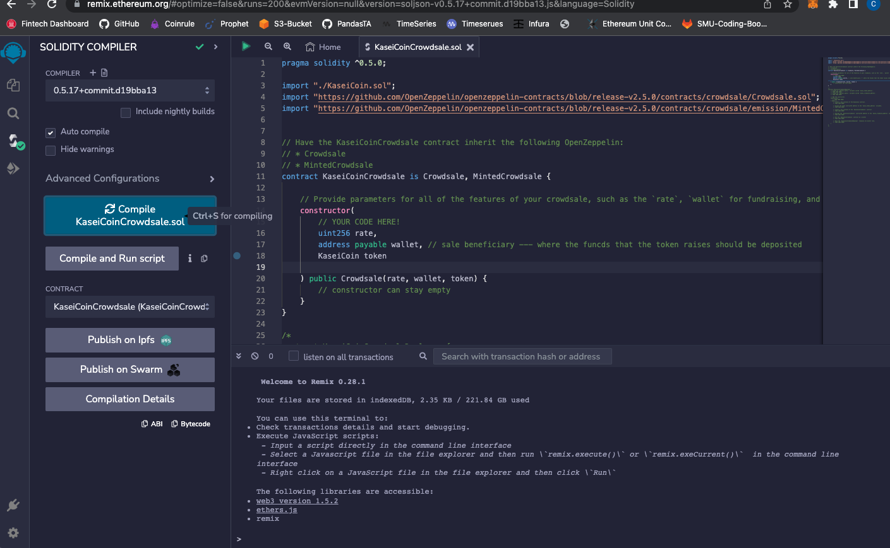
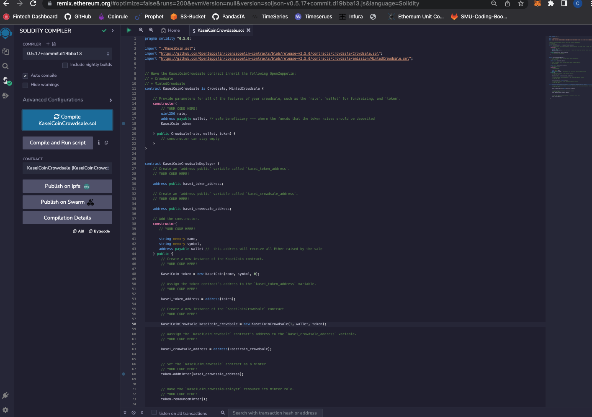
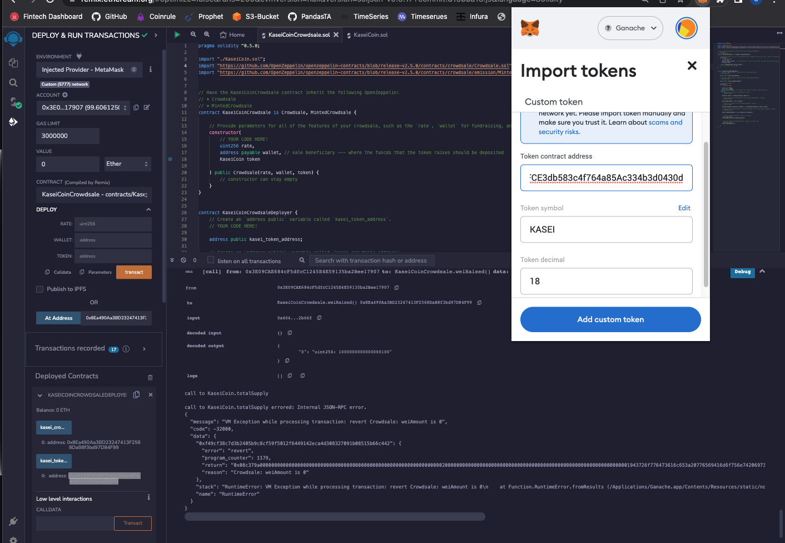
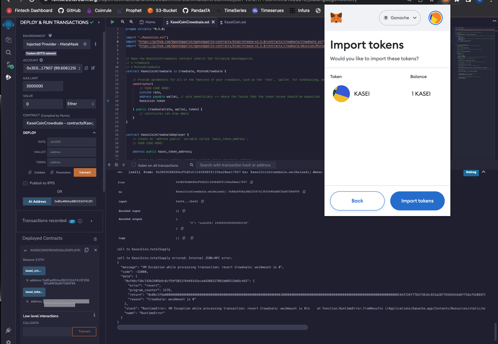

# Module_21_Challenge

## Challenge: Martian Token Crowdsale

---

We will create a fungible token that is ERC-20 compliant and that will be minted by using a Crowdsale contract from the OpenZeppelin Solidity library.

The crowdsale contract will manage the entire crowdsale process, allowing users to send ether to the contract and in return receive _**KASEI**_ , or KaseiCoin tokens.

* Symbol: KASEI
* Token Name: KaseCoin

## Technologies

[MetaMask](https://metamask.io/download/) - MetaMask is a digital wallet for the Ethereum blockchain

_[Solidity](https://soliditylang.org/)_ - This is a programming language we use to create smart contracts.

_[Remix IDE website](https://remix.ethereum.org/)_ - This is where we build and test smart contracts that we create with Solidity.

[Ganache](https://www.trufflesuite.com/ganache) This program allows you to quickly and easily set up/test a local blockchain.

---

## Usage

Here are the steps:

1. Create the KaseiCoin Token Contract

2. Create the KaseiCoin Crowdsale Contract

3. Create the KaseiCoin Deployer Contract

4. Deploy the Crowdsale to a Local Blockchain

---

Here are the images to show the steps listed above:

KaseiCoin Contract
> 

KaseiCoin Crowdsale Contract
> 

KaseiCoin Deployer Contract
> 

Deploy the Crowdsale to a Local Blockchain
> 

Use test accounts to buy new tokens.
> 

---

After purchasing tokens with test accounts, view the total supply of minted tokens and the amount of wei that has been raised by the crowdsale. See the video below:

<https://user-images.githubusercontent.com/60047556/208759433-e3433b28-30c6-4e0a-b293-375e77685ada.mov>

---

## Contributors

**_G. Cale McDowell_**

[@gcm107](https://github.com/gcm107)

